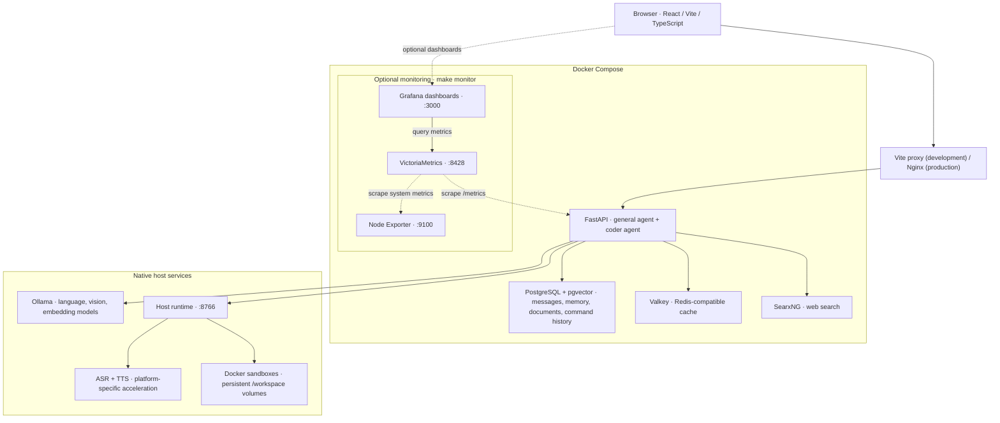

# RealOpen-AI

A self-hosted AI workspace for local chat, voice conversations, coding, and document creation.

RealOpen-AI runs language models through Ollama on your machine, with a FastAPI backend and a React interface. It includes a tool-using general assistant, a dedicated coder agent, persistent memory, document retrieval, and reusable skills. Hardware profiles select separate models for chat, coding, voice, vision, and embeddings.

## Features

- **Chat and agent tools:** streaming Markdown, reasoning and tool-call details, image input, web search and page fetching, Python execution, and conversation search.
- **Persistent conversations:** incremental response saving, user interruption badges, and text-stream reconnection after a page reload. Navigating within the app does not abort text generation or an active voice call.
- **Voice calls:** speech recognition → the agent loop → streamed speech synthesis, with microphone mute, barge-in, voice selection, playback speed, and built-in or custom personas. The call interface supports a minimized floating overlay.
- **Coding workspaces:** a dedicated coder can automatically create a Docker sandbox for a conversation. Browse files, inspect highlighted code and diffs, watch command output, use an independent interactive shell, and preview running applications.
- **Brain:** manage memories, browse history, configure tools, and create or import local skills. Skills can be global or assigned to general, coder, or voice roles; routing exposes short metadata and loads instructions and resources on demand.
- **Learn:** create and edit Markdown flashcard decks, generate them through chat or retrieved document excerpts, and study with persistent SM-2-based spaced repetition, review history, and keyboard shortcuts. Decks and progress live in PostgreSQL; chat deck cards open Learn or a focused right-panel study session.
- **Documents and assets:** upload documents for retrieval-augmented answers, manage templates and generated files, and generate spreadsheets, presentations, PDF reports, and Word documents. Image generation is an optional hardware-dependent module.
- **Personalization:** model and tool settings, theme accents, English/French/Arabic interfaces with RTL support, and completion notifications with configurable sound and browser notifications.

Local inference does not require a paid cloud LLM API. **Local-first does not mean every feature is offline:** initial setup downloads images, packages, and model weights; web search, page fetching, dependency installation, optional remote access, and explicitly configured external providers use the network. Once the necessary models are cached, local chat and voice can run without those online features.

## Architecture



### Responsibilities

| Component | Responsibility |
| --- | --- |
| Frontend | React, Vite, TypeScript, Tailwind, Zustand, React Router, Markdown/syntax highlighting, and xterm terminals |
| Backend | FastAPI, async SQLAlchemy, Alembic migrations, agent loops, tool orchestration, persistence, and streaming |
| Ollama | Native host inference; avoids placing model inference inside the application containers |
| Host runtime | Native speech processing and Docker sandbox management, reached by the backend through `host.docker.internal` |
| Sandbox containers | Isolated coding environments with Python, uv, Bun, Node.js, Git, SQLite, and project helpers |
| PostgreSQL + pgvector | Application records and vector retrieval |
| Valkey / SearxNG | Redis-compatible caching and self-hosted search aggregation |
| Optional monitoring | VictoriaMetrics, Grafana, and exporters |

Text responses use SSE. Voice and terminal sessions use WebSockets. The backend owns active text-generation tasks independently of the browser connection and persists response progress. Reconnection after a browser reload is supported while the backend process remains alive; this is not durable job recovery across a backend restart.

## Getting started

### Requirements

- Git, Make, and Docker with Docker Compose.
- Python **3.11+** and Poetry for the native host runtime and local backend tooling.
- Enough RAM/VRAM and disk space for your selected models, Docker images, and generated workspaces.
- Node.js **24** and npm if running frontend tests or developing outside Docker.

Use macOS, Linux, or Windows through **WSL2** with Docker Desktop integration. The shell scripts and Makefile assume a Unix-like shell. On Apple Silicon, the voice installer supports the native MLX path; other platforms use the available native speech runtime. Actual acceleration depends on the hardware and installed packages.

### First run

```sh
git clone https://github.com/realopen-ai/realopen-ai.git
cd realopen-ai

# Install host runtime dependencies.
cd backend
poetry install --no-root --with dev
cd ..

# Detect hardware, configure .env, install/start Ollama, and download models.
make setup

# Start the app in development mode.
make
```

Open **http://localhost:5173**. The web setup flow and settings expose model/dependency installation and configuration. Initial downloads and builds can take time.

`make` defaults to `make dev`, **not production**. Startup creates `.env` if needed, attempts to start Ollama and the host runtime, and builds the sandbox image if missing. Run `make setup` explicitly for first-time model setup.

For production:

```sh
make up
```

Open **http://localhost** (or the port configured with `NGINX_PORT`). Production serves the frontend through Nginx; development uses Vite's API/WebSocket proxy.

### Voice setup

Speech models are configured in the top-level `voice:` section of [profiles.yml](profiles.yml). The current defaults are **Qwen3-ASR 0.6B** and **Pocket TTS**, with English speech configuration.

```sh
make voice-install
```

Voice settings support catalog voices and WAV-based custom voice cloning. Cloning requires accepting the model's terms at [kyutai/pocket-tts](https://huggingface.co/kyutai/pocket-tts) and authenticating on the host:

```sh
uvx hf auth login
```

Restart the host runtime after changing authentication if necessary. Do not commit tokens. Browser microphone permission is required; use localhost or HTTPS. Interface language support does not imply equivalent ASR/TTS language support.

### Coding workspaces

Delegating a coding task creates a default sandbox when the conversation has none. You can also create and manage workspaces from **Workspace → Sandboxes**, including CPU, RAM, and storage settings.

The right panel provides:

- A resizable file tree, syntax-highlighted file view, and resizable terminal.
- **Terminal** for agent command history and output; **User shell** for your own interactive session.
- A separate **Preview** tab with an editable local address.

Project helpers use **6969** for backend servers and **6767** for frontend servers. The preview prioritizes the frontend when available. Host access uses the published/assigned port; check the preview address rather than assuming a fixed port is free when multiple workspaces are running.

Workspace files live in Docker-managed named volumes mounted at `/workspace`, not in a visible host `sandbox/workspace/` directory. Stopping or recreating the compute container preserves the volume; deleting a workspace removes its data. Agent command history is stored in PostgreSQL.

## Configuration

| File / setting | Purpose |
| --- | --- |
| [profiles.yml](profiles.yml) | Hardware profiles and role-specific models; shared ASR/TTS defaults |
| [modules.yml](modules.yml) | Required assistant module and optional image-generation model requirements |
| [.env.example](.env.example) → `.env` | Application switches, service URLs, hardware profile, and voice tuning |
| `HARDWARE_PROFILE` | Select the detected or manually chosen profile |
| `ENABLED_MODULES` | Enable supported optional modules |
| `VOICE_RUNTIME_URL` | Backend address of the native host runtime |
| Settings UI | Model overrides, tools, voice, personas, appearance, language, and notifications |

Available profile families:

| Hardware | Profiles |
| --- | --- |
| CPU-only | `cpu_small`, `cpu_medium` |
| NVIDIA | `nvidia_small`, `nvidia_medium`, `nvidia_large`, `nvidia_xlarge` |
| Apple Silicon | `apple_small`, `apple_medium`, `apple_large`, `apple_xlarge` |

Model roles include `default` (general chat), `default_coder`, `default_utility`, `role_voice`, `default_vision`, and `default_embedding`. See `profiles.yml` for the actual model IDs and sizes rather than a duplicated model table.

## Commands

| Command | Purpose |
| --- | --- |
| `make` / `make dev` | Development environment with hot reload |
| `make dev-d` | Development environment in the background |
| `make setup` | First-time hardware and model setup |
| `make up` | Production environment |
| `make down` / `make re` | Stop services / restart development |
| `make logs` / `make logs-backend` | Follow application logs |
| `make health` | Check service health |
| `make detect-hardware` | Update hardware detection |
| `make pull-models` / `make pull-module-models` | Download profile / optional module models |
| `make voice-install` / `make sandbox-build` | Install speech runtime/models / build sandbox image |
| `make shell-backend` / `make shell-db` | Open backend / database shells |
| `make migrate` / `make migration` | Apply / create Alembic migrations |
| `make monitor` / `make monitor-down` | Start / stop optional monitoring |
| `make validate-profiles` / `make validate-modules` | Validate model configuration |
| `make test-backend` / `make test-frontend` | Run each test suite |
| `make test` | Run both suites |
| `make coverage` | Backend coverage report with an 80% minimum |

**Destructive:** `make clean` removes Compose containers, volumes, and images. Back up important data first. `make tunnel` enables optional Ngrok access and requires separate configuration; do not expose the app casually.

## Development and tests

Install local test dependencies:

```sh
cd backend
poetry install --no-root --with dev
cd ../frontend
npm ci
cd ..

make test
make coverage
```

Do not activate an unrelated virtual environment before running Poetry: it may select that environment instead of the backend's.

Filter backend tests or override the coverage threshold:

```sh
make test-backend PYTEST_ARGS='tests/test_core_metrics.py'
make coverage COVERAGE_MIN=80
```

Additional checks:

```sh
cd backend
poetry run ruff check app tests
cd ../frontend
npm run format:check
npm run build
```

PDF rendering requires native WeasyPrint libraries in addition to Python dependencies. PDF-dependent tests skip when those libraries are unavailable locally; CI installs the Linux rendering libraries. Optional native rendering tools may also affect preview tests.

GitHub Actions checks frontend formatting/tests/build, backend lint/tests/coverage and migrations, configuration validation, Docker builds, and CodeQL analysis. Dependency updates are configured through Dependabot. Tests mock model/provider interactions and do not need a running Ollama instance. Documentation-only changes are excluded from the main CI workflow.

## Project layout

```text
realopen-ai/
├── backend/
│   ├── app/
│   │   ├── agent/          # General agent, coder loop, and tool adapters
│   │   ├── api/            # Chat, voice, skills, workspaces, settings, etc.
│   │   ├── prompts/        # Agent and specialized task instructions
│   │   ├── services/       # Retrieval, memory, generation, streams, persistence
│   │   ├── voice/          # ASR, TTS, VAD, echo cancellation, sessions
│   │   └── db/             # SQLAlchemy models and session management
│   ├── alembic/            # Database migrations
│   └── tests/
├── frontend/
│   ├── src/                # Routed UI, components, API clients, Zustand stores
│   └── tests/
├── scripts/
│   ├── host-runtime-server.py  # Native speech and sandbox API
│   ├── sandbox_runtime.py      # Docker workspace operations
│   ├── setup.sh
│   └── startup.sh
├── sandbox/                # Coding container image and project helpers
├── nginx/                  # Production gateway and streaming/WS proxy
├── monitoring/             # Search configuration and observability
├── data/                   # Host runtime cache, installed resources, local skills
├── .github/                # CI, CodeQL, and dependency updates
├── profiles.yml
├── modules.yml
└── Makefile
```

## Persistence and safety

Compose named volumes hold PostgreSQL data, uploads, module state, and caches. The host `data/` directory stores shared runtime resources such as Hugging Face downloads, custom voices, and skills. Coding workspaces use their own named Docker volumes.

The host runtime binds to loopback and has Docker-management capabilities. Keep it private. Sandbox containers are a separation boundary, not a guarantee that arbitrary code is safe. Review imported skills/scripts and generated code before running them.

The default configuration is intended for local use. Before exposing it remotely, review authentication, reverse-proxy access controls, TLS, service ports, and default database/Grafana credentials. Browser notifications require permission; background-tab delivery and sound also depend on browser and operating-system policies.

## License

[MIT](LICENSE). Third-party models, voice weights, and dependencies retain their own licenses and terms.
