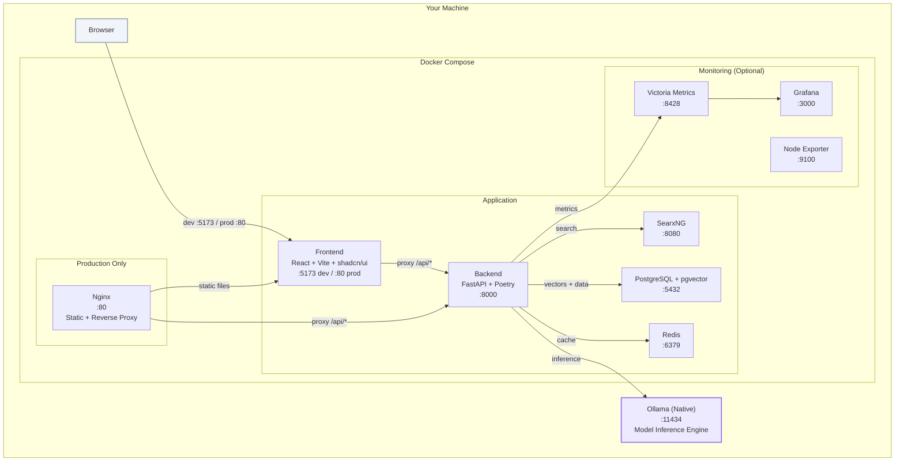

# RealOpen-AI

> Fully offline, local AI chatbot. One `make` command to run.

RealOpen-AI is a self-hosted, privacy-first AI chatbot that runs entirely on your machine. No cloud, no API keys, no data leaving your computer. It automatically detects your hardware specs and selects the best LLM model for your system.

## Architecture



### Key Design Decisions

| Decision       | Choice                     | Rationale                                                                       |
| -------------- | -------------------------- | ------------------------------------------------------------------------------- |
| **Backend**    | Modular Monolith (FastAPI) | Single Python process saves RAM on 8GB machines; modules can be extracted later |
| **Inference**  | Ollama (native on host)    | GPU acceleration on all platforms; auto model management; macOS Metal support   |
| **Frontend**   | React + Vite + shadcn/ui   | Fast HMR in dev, tiny production builds, accessible component library           |
| **Database**   | PostgreSQL + pgvector      | Production-grade with vector search for RAG from day one                        |
| **Monitoring** | Victoria Metrics           | Prometheus-compatible but uses ~5x less RAM than Prometheus                     |
| **Streaming**  | SSE (Server-Sent Events)   | Simpler than WebSocket, auto-reconnects, good for LLM token streaming           |

### Data Flow

```
Browser → Vite/Nginx → FastAPI /api/* → Ollama (inference)
                                      → SearxNG (web search)
                                      → PostgreSQL (RAG + history)
                                      → Redis (cache)
```

## Prerequisites

Before you begin, install these on your machine:

| Tool               | Why                  | Install                                                                     |
| ------------------ | -------------------- | --------------------------------------------------------------------------- |
| **Docker Desktop** | Runs all services    | [docker.com/get-docker](https://docs.docker.com/get-docker/)                |
| **Git**            | Clone the repo       | [git-scm.com](https://git-scm.com/downloads)                                |
| **Make**           | Run project commands | macOS: `xcode-select --install` · Linux: `sudo apt install build-essential` |

> **Note:** Ollama is installed automatically by the setup script. You don't need to install it manually.

> **Note:** Windows is supported via WSL2. Use Docker Desktop's WSL integration and run all commands from the WSL terminal.

## Quick Start

```bash
# 1. Clone the repository
git clone https://github.com/realopen-ai/realopen-ai.git
cd realopen-ai

# 2. Run first-time setup (detects hardware, installs Ollama, pulls model)
make setup

# 3. Start development mode (hot reload for frontend + backend)
make dev
```

Then open **http://localhost:5173** in your browser.

## Makefile Commands

| Command              | Description                                                      |
| -------------------- | ---------------------------------------------------------------- |
| `make setup`         | First-time setup: hardware detection, Ollama install, model pull |
| `make dev`           | Start in development mode (hot reload, exposed ports)            |
| `make dev-d`         | Start in development mode (detached/background)                  |
| `make` / `make up`   | Start in production mode (Nginx, optimized builds)               |
| `make down`          | Stop all services                                                |
| `make clean`         | Remove all containers, volumes, and images                       |
| `make monitor`       | Start monitoring stack (Victoria Metrics + Grafana)              |
| `make monitor-down`  | Stop monitoring stack                                            |
| `make tunnel`        | Start Ngrok tunnel for remote access                             |
| `make logs`          | View logs from all services                                      |
| `make logs-backend`  | View backend logs only                                           |
| `make health`        | Run health check on all services                                 |
| `make shell-backend` | Open shell in backend container                                  |
| `make shell-db`      | Open PostgreSQL shell                                            |
| `make migrate`       | Run database migrations                                          |
| `make migration`     | Create a new database migration                                  |
| `make pull-model`    | Pull the default Ollama model                                    |

## Hardware Profiles

The setup script automatically detects your hardware and selects the best model:

| Profile | RAM      | GPU | Default Model | Model Size |
| ------- | -------- | --- | ------------- | ---------- |
| `8gb`   | 8-10 GB  | Any | `qwen3:7b`    | ~4 GB      |
| `16gb`  | 10-20 GB | Any | `qwen3:14b`   | ~8 GB      |
| `32gb`  | 20-40 GB | Any | `qwen3:32b`   | ~20 GB     |
| `64gb`  | 40+ GB   | Any | `qwen3:32b`   | ~20 GB     |

> NVIDIA GPU VRAM is factored in: a 16GB RAM machine with an 8GB GPU gets the `16gb` profile.

## Project Structure

```
realopen-ai/
├── Makefile                          # Single entrypoint for all commands
├── .env.example                      # Configuration template
├── docker-compose.yml                # Production services
├── docker-compose.dev.yml            # Development overrides (hot reload)
├── docker-compose.monitoring.yml     # Victoria Metrics + Grafana
│
├── scripts/
│   ├── setup.sh                      # First-time setup (hardware + Ollama)
│   └── health-check.sh               # Verify all services are healthy
│
├── backend/                          # FastAPI (Python, Poetry)
│   ├── pyproject.toml                # Dependencies
│   ├── Dockerfile                    # Production build
│   ├── Dockerfile.dev                # Dev build (hot reload)
│   ├── alembic.ini                   # Database migration config
│   ├── alembic/                      # Migrations
│   └── app/
│       ├── main.py                   # FastAPI app + lifespan
│       ├── config.py                 # Pydantic Settings (env vars)
│       ├── api/
│       │   ├── health.py             # /api/health
│       │   └── chat.py               # /api/chat, /api/chat/stream, /api/models
│       └── db/
│           ├── session.py            # Async SQLAlchemy session
│           └── models.py             # ORM models (Conversation, Message, Document)
│
├── frontend/                         # React + Vite + TypeScript + shadcn/ui
│   ├── package.json
│   ├── vite.config.ts                # Vite config + API proxy
│   ├── tailwind.config.ts            # Tailwind + shadcn/ui theme
│   ├── Dockerfile                    # Production build
│   ├── Dockerfile.dev                # Dev build (Vite HMR)
│   └── src/
│       ├── main.tsx                  # React entry point
│       ├── App.tsx                   # Chat UI with SSE streaming
│       └── lib/utils.ts              # shadcn/ui cn() utility
│
├── nginx/                            # Production gateway
│   ├── Dockerfile                    # Builds frontend + nginx
│   └── nginx.conf                    # Full config with upstreams + SSE
│
└── monitoring/                       # Optional observability stack
    ├── victoria-metrics/
    │   └── prometheus.yml            # Scrape config
    └── grafana/
        └── provisioning/             # Auto-provisioned datasources
```

## Development

### Dev Mode Architecture

In development, there is **no Nginx**. The Vite dev server handles both static files and API proxying:

```
Browser (:5173) → Vite Dev Server → proxy /api/* → Backend (:8000)
                                  → static files → React HMR
```

All services have their ports exposed for debugging:

- **Frontend:** http://localhost:5173
- **Backend:** http://localhost:8000 (API docs at /docs)
- **PostgreSQL:** localhost:5432
- **Redis:** localhost:6379
- **SearxNG:** localhost:8080

### Backend Development

The backend uses **Poetry** for dependency management. Code is volume-mounted into the container, and uvicorn auto-reloads on changes.

```bash
# Add a new dependency
docker exec realopen-backend poetry add <package>

# Run database migration
make migrate

# Create a new migration (after changing models)
make migration
```

### Frontend Development

The frontend uses **Vite** with hot module replacement. Code is volume-mounted, and changes reflect instantly in the browser.

```bash
# Add a new npm package
cd frontend && npm install <package>

# Add a shadcn/ui component
cd frontend && npx shadcn-ui@latest add button
```

## Production

```bash
# Build and start all services (Nginx serves frontend + proxies API)
make up

# App is available at http://localhost
```

In production, Nginx serves the built React SPA and proxies API requests to the backend:

```
Browser (:80) → Nginx → /api/* → Backend (:8000)
                      → /*     → Static files (built React SPA)
```

## Monitoring

```bash
# Start monitoring stack
make monitor

# Access Grafana at http://localhost:3000 (admin/admin)
# Victoria Metrics at http://localhost:8428
```

The monitoring stack includes:

- **Victoria Metrics** — Prometheus-compatible metrics collection (5x less RAM than Prometheus)
- **Grafana** — Dashboards and visualization
- **Node Exporter** — Host-level metrics (CPU, RAM, disk, network)

> **Why not cAdvisor?** Docker's built-in `docker stats` API provides container metrics without the overhead of a separate cAdvisor container.

## Remote Access (Ngrok)

```bash
# Set your Ngrok authtoken in .env
echo "NGROK_AUTHTOKEN=your_token_here" >> .env

# Start the tunnel
make tunnel

# Get the public URL
docker logs realopen-ngrok 2>&1 | grep "https://"
```

## Tech Stack

| Layer           | Technology                        | Version      |
| --------------- | --------------------------------- | ------------ |
| Frontend        | React + Vite + TypeScript         | 19 / 6 / 5.6 |
| UI Components   | shadcn/ui + Tailwind CSS          | latest / 3.4 |
| Backend         | FastAPI + Uvicorn                 | 0.115 / 0.32 |
| Package Manager | Poetry                            | latest       |
| Database        | PostgreSQL + pgvector             | 16           |
| Cache           | Redis                             | 7            |
| Search          | SearxNG                           | latest       |
| Inference       | Ollama (native)                   | latest       |
| Reverse Proxy   | Nginx                             | 1.25         |
| Monitoring      | Victoria Metrics + Grafana        | latest       |
| Metrics         | Prometheus FastAPI Instrumentator | 7            |

## License

MIT License - See [LICENSE](/LICENSE) file for details.
